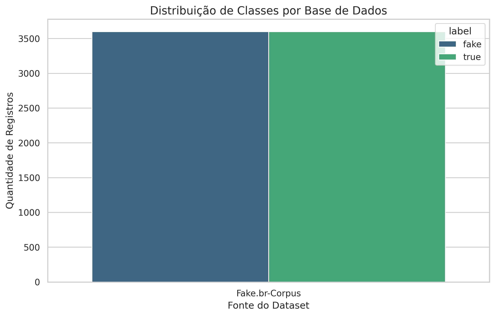
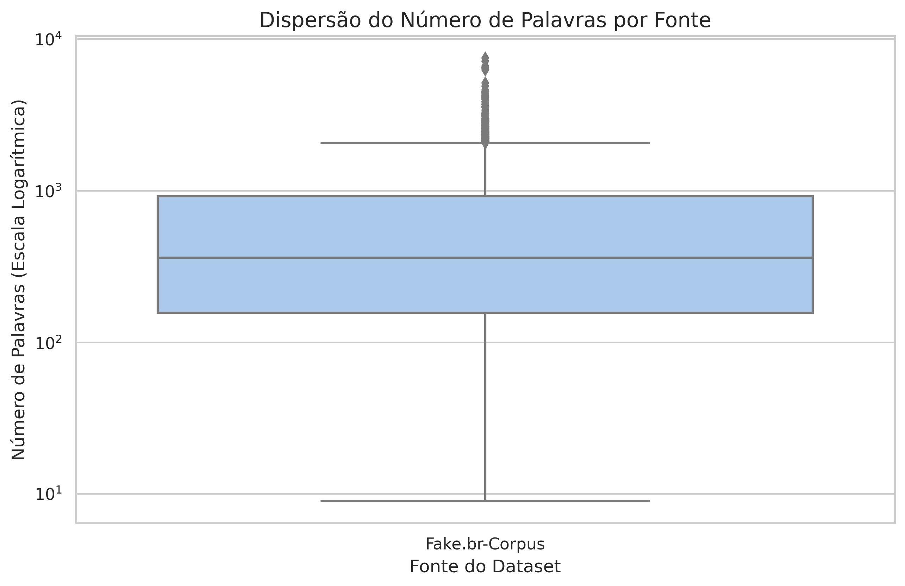

# Análise Exploratória de Dados (EDA) - Grupo 7

## 1. Visão Geral do Dataset Unificado
Para garantir a robustez na detecção de desinformação, unificamos três bases de dados distintas, resultando em um corpus extenso e heterogêneo.
*   **Volumetria Total:** 19.103 registros.
*   **Média de Palavras:** 370 palavras por notícia.
*   **Valores Nulos Críticos:** A base FakeRecogna apresentou ~53% de nulidade na coluna `subtitle`, o que justificou a nossa decisão de utilizar apenas o corpo do texto (`text`) para a modelagem.

## 2. Distribuição das Classes e Fontes

A análise revela um desbalanceamento estrutural na composição do corpus de treinamento. Aproximadamente 59% dos dados de treino são oriundos do dataset **FakeRecogna**. Isso gerou um impacto profundo no aprendizado da IA, mascarando os sinais reais de desinformação.

## 3. Dispersão e Tamanho dos Textos

Observamos uma alta variância no tamanho dos documentos. As notícias reais e os textos do *Fake.br-Corpus* possuem, em média, 643 palavras, enquanto a arquitetura padrão do modelo semântico (BERT) processa apenas os primeiros 128 tokens (palavras/subpalavras).

## 4. O Insight Principal (Diagnóstico de Viés)
Durante a EDA, identificamos um fenômeno severo de *Domain Shift* e vazamento de dados que estava forçando o modelo a classificar 99% das notícias do mundo real como "Fake". 

**A causa raiz metodológica:**
1. **O Apagamento do Sinal:** O dataset *FakeRecogna* (que compõe 59% do treino) é distribuído já pré-processado (lematizado, sem pontuação e sem maiúsculas). Isso "apagou" *features* cruciais como exclamações e uso de Caps Lock no momento do treinamento.
2. **A Falsa Correlação:** Quando o modelo é exposto a uma notícia real (como no Telegram), que possui pontuação e formatação normal, ele não reconhece o padrão estatístico lematizado do *FakeRecogna*. Como consequência, a Inteligência Artificial associa incorretamente "textos com pontuação normal" à classe Fake.
3. **O Gargalo do BERT:** A limitação de `MAX_SEQUENCE_LENGTH = 128` faz com que o modelo decida a veracidade lendo apenas o primeiro parágrafo de textos que possuem, em média, 643 palavras.

**Plano de Ação (Próximos Passos):**
Para corrigir este viés estrutural, iremos recalibrar a extração de *features* estilométricas utilizando exclusivamente bases não-processadas (*Fake.br* e *FACTCK.BR*) e ajustaremos a capacidade de leitura do BERTimbau para 512 tokens.